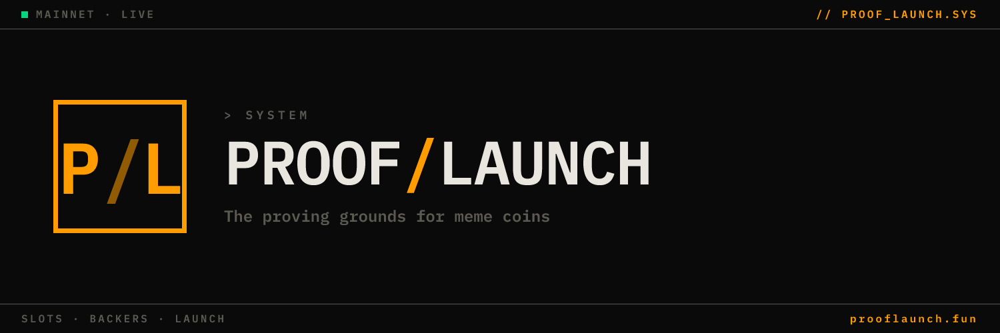

# Proof Launch

**Shared Pump.fun launches. Equal entry. Shared trading fees.** A pre-launch commitment layer on top of [Pump.fun](https://pump.fun) — communities form *before* a token exists. A meme can only launch once all its backer slots are claimed, and when they fill, the meme's shared pool wallet executes ONE atomic `createV2 + buy` on Pump.fun. Every backer enters at the identical price. Dev holds zero. Trading fees flow back to backers proportional to slot share.

🌐 [prooflaunch.fun](https://prooflaunch.fun) · 𝕏 [@ProofLaunch](https://x.com/ProofLaunch)

---

## How it works

1. **Submit.** A creator submits a meme and sets **2–8 backer slots**, each with a minimum SOL contribution. Submission costs **0.02 SOL** (non-refundable, anti-spam tax). The platform provisions two keypairs per meme: a **pool wallet** (collects backers' SOL) and a **sub-escrow wallet** (becomes the coin's on-chain `coin_creator`, isolates the coin's future trading fees).

2. **Back.** Backers claim slots first-come, first-served. Each backing transfers SOL directly into the meme's pool wallet on-chain. Backers can withdraw at any time during the backing phase (2% fee).

3. **Launch.** When all slots fill, the creator clicks Launch. The pool wallet executes a single atomic `createV2 + buy` transaction on Pump.fun:
   - The token is created in the same block as the dev buy → **zero sniper gap**.
   - The buy spends the entire pool balance → **every backer enters at the same price**.
   - The creator (sub-escrow) holds no tokens directly → **dev allocation is 0%**.
   - Every Proof Launch coin's contract address ends in **`…pooL`** so anyone can verify on-chain that it's a real Proof launch.

4. **Distribute.** Each backer's proportional share of the pool's tokens is automatically sent to their wallet in the same request as the launch. No claim button required.

## Refund protection

Two automatic safety nets ensure backer SOL is never permanently stuck:

- **3-day backing deadline.** If slots don't fill within the creator's chosen window, every backer is automatically refunded 100% (no fee).
- **24-hour launch window.** Once funded, the creator has 24 hours to launch. If they don't, every backer is automatically refunded 100% (no fee). Closes the abandonment hole where a creator could leave backers waiting indefinitely.

Both refund paths run on the same hourly cron via the proven `refundMemePool` function — no support tickets, no human in the loop.

## Trading fees

Pump.fun routes a share of every trade on a launched token back to the on-chain `coin_creator` PDA. Because each Proof meme has its own per-coin sub-escrow as `coin_creator`, fees isolate exactly per coin and are independently verifiable on-chain.

Hourly, a cron job:
1. Calls `collect_creator_fee` on each coin's vault → drains to that coin's sub-escrow.
2. Sweeps the sub-escrow → shared platform escrow.
3. Splits **90% to backers** (proportional to backing size) / **10% to the platform**.
4. Credits each backer's `claimable_fees_sol` in the database.

Backers claim their share with one click (per-meme or aggregate "Claim All") — payout is a single SOL transfer from escrow to the backer's wallet.

## Stack

- **Frontend:** Next.js (App Router) + React + TypeScript, hosted on Vercel
- **Wallet:** Solana Wallet Adapter (Phantom, Solflare, …)
- **Database:** Supabase (Postgres + RLS)
- **Chain:** `@solana/web3.js`
- **Token launches:** [`@pump-fun/pump-sdk`](https://www.npmjs.com/package/@pump-fun/pump-sdk) (official Pump.fun SDK)
- **Bundling:** Jito (with RPC fallback) for atomic createV2+buy

Core launch logic: [`src/services/pumpfun.ts`](src/services/pumpfun.ts). Fee collection + distribution: [`src/services/distribution.ts`](src/services/distribution.ts). Key encryption (AES-256-GCM) + signature verification: [`src/lib/crypto.ts`](src/lib/crypto.ts).

## Local development

```bash
npm install
cp .env.example .env.local
# Fill in .env.local with your Supabase, Solana RPC, and escrow wallet credentials
npm run dev
```

See [`.env.example`](.env.example) for required environment variables. The repo intentionally ships no secrets — you must provision your own.

Database schema lives in [`supabase/migrations/`](supabase/migrations/). Apply them via the Supabase SQL editor in order.

## Security

Backer funds are non-custodial in the sense that they sit in a per-meme pool wallet (one wallet per meme, not a global pot) until the meme either launches or refunds. Pool wallets are controlled by the platform; their behavior is constrained to exactly two actions: **launch** (atomic createV2+buy on Pump.fun) or **refund** (return SOL to original backers). No third action is possible from the API surface.

See [SECURITY.md](SECURITY.md) for responsible disclosure and audit status.

> ⚠️ Not formally audited by a third-party firm. Meme coins are highly speculative. Don't back more than you can afford to lose.

## License

[AGPL-3.0](LICENSE) — fork and modify freely, but if you run a modified version as a network service you must publish your source.
